LibreClinica 1.0 for Investigators
==================================

[https://libreclinica.org](https://libreclinica.org) © 2020

Preface

This manual describes the main activities of the Investigator-role in LibreClinica 1.00: Entering data, Handling Discrepancies and Signing Subjects.

To use this manual an account with the role of Investigator is the only requirement.

Please contact us for other manuals for the roles of Clinical Research Coordinator or Monitor or if you would like a tailor-made manual, based on this one.

[The LibreClinica Community](https://libreclinica.org)

The manual is a distributed under the <a name="firstheading">Creative Commons Attribution-ShareAlike 3.0 Unported License . This means you are free to copy, distribute and transmit the work, and to adapt the work under the following conditions:</a>

1 you must attribute the work in the manner specified by the author (but not in any way that suggests that they endorse you or your use of the work.); please contact us for details

2 if you alter, transform, or build upon this work, you may distribute the resulting work only under the same, similar or a compatible license.

# Contents

[Choosing your browser and starting](#choosing-your-browser-and-starting)

[Logging in](#logging-in)

[Changing your password on first time log-in](#changing-your-password-on-first-time-log-in)

[Logging out](#logging-out)

[Changing your password](#changing-your-password)

[When you've lost your password](#when-youve-lost-your-password)

[Change Study/Site](#change-studysite)

[Your "Home" in LibreClinica](#your-home-in-libreclinica)

[Adding Study Subjects](#adding-study-subjects)

[Choosing a subject; a shortcut; the Subject Matrix; filtering and sorting](#choosing-a-subject-a-shortcut-the-subject-matrix-filtering-and-sorting)

[Adding or scheduling Events](#adding-or-scheduling-events)

[Data-entry: elements in the screen](#data-entry-elements-in-the-screen)

[Changing the attributes of an Event](#changing-the-attributes-of-an-event)

[Data-entry: required fields and error-messages](#data-entry-required-fields-and-error-messages)

[Adding a Note](#adding-a-note)

[Discrepancies: filtering by status, type, Event, Subject](#discrepancies-filtering-by-status-type-event-subject)

[An example of a discrepancy](#an-example-of-a-discrepancy)

[Mark CRF Complete](#mark-crf-complete)

[The status of a CRF and of an Event](#the-status-of-a-crf-and-of-an-event)

[Signing CRFs](#signing-crfs)

[Changing data in complete CRFs](#changing-data-in-complete-crfs)

# Choosing your browser and starting

To use LibreClinica you need a browser. You can use Firefox (Mozilla) version 3 or higher, Microsoft Internet Explorer version 7 or higher, Google Chrome or Safari (Mac). Furthermore your browser must be set up to execute Java-script.

In Firefox you can check this by clicking the menu-option "Tools"-"Options". In the window that opens, click on the tab "Content" and make sure "Enable JavaScript" is checked.
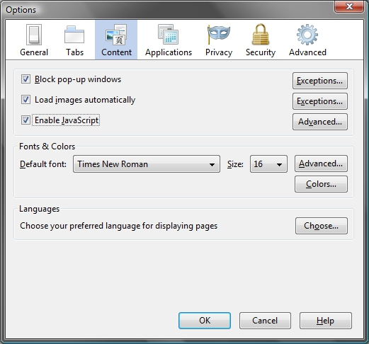

In Internet Explorer you can check if Java-script is enabled by clicking menu option "Tools", "Internet options". In the window that opens click on tab "Security". Then you click "Custom Level ..." Scroll down to "Scripting" and check if "Active Scripting" is set to "Enable".
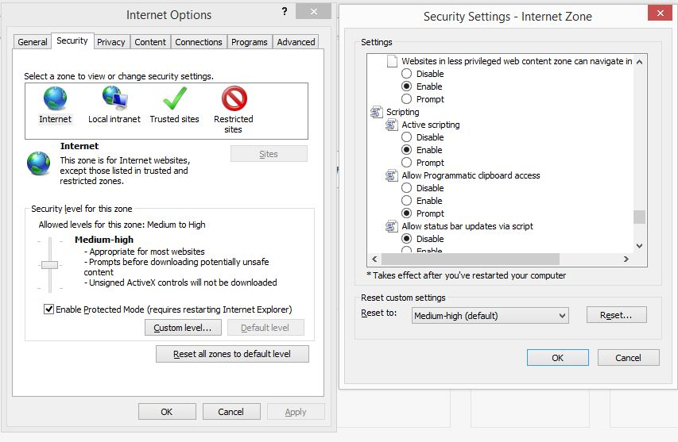

# Logging in

To start LibreClinica, type in the address you've been given, e. g. [https://libreclinica.org/lc-demo/](https://libreclinica.org/lc-deb10/pages/login/login) and the login-screen appears.
You can log in with the user name and password that have been sent to you by mail. Click on button Login.
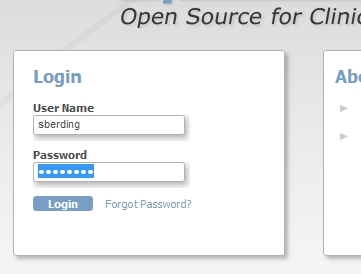

# Changing your password on first time log-in

Because this is the first time you log in to LibreClinica, you will be asked to change your password. In the form that opens, "Reset password", you are asked to once more type in the password you've been given, Old Password. In the next input you type your new password, directly followed by the same password, New Password and Confirm New Password.
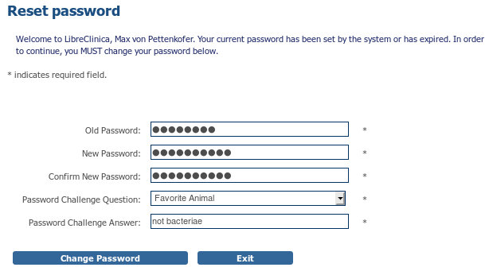

After that you must choose a question plus the answer to that question. These will be used in case you have lost your password and have to request a new one. For example: Password Challenge Question you  choose Favorite Color, with Password Challenge Answer blue.

# Logging out

When you're finished with data-entry you must log out. This prevents unauthorized persons from viewing or changing  data. You log out by clicking Log Out in the upper right corner of the screen.

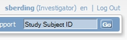

# Changing your password
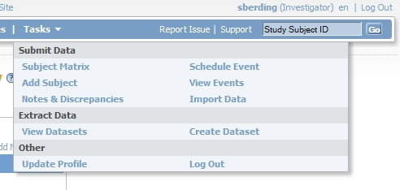

You can change your password any time by clicking on menu option Tasks and then choosing Update Profile.
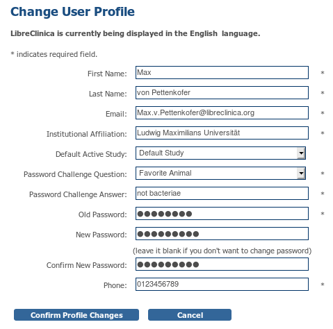

The form "Change User Profile" appears, allowing you to change data about your account. All fields with an asterisk * are required. This means you must provide a telephone number for Phone. Of course this can be any number. To save the changes you must provide your password, even if you have only changed for example your email. In that case you can leave field New Password blank.

After clicking button Confirm Profile Changes, the screen "Confirm User Profile Updates" opens. Check your account-data one more time and click button Update Profile. In the left column of the screen the message "Your profile has been updated successfully" appears.

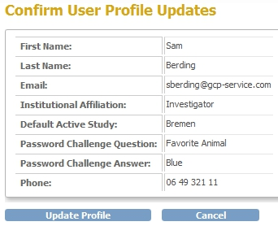

# When you've lost your password

When you've lost your password you can request a reset of the password. A new, random password will be sent to the email-address you provided in your account-data. You request this new password by clicking Forgot Password? in the log in screen. The form "Request Password Form" opens.

Type in User Name your user-name and in Email the email address, as used in LibreClinica. Then you select the Password Challenge Question and give your Password Challenge Answer. Click button Submit Password Request and after a few minutes a mail will be sent to you with the new password. After logging in with this new password, you must change it immediately, just as when you log in for the first time.
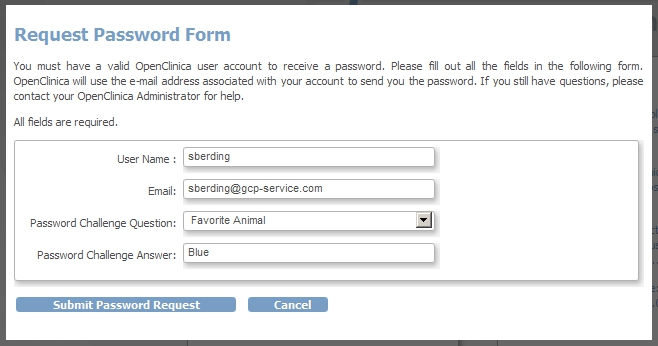

# Change Study/Site

When you log in to LibreClinica, your active study will be the study you last worked on. If you are assigned to more than one study, you can change to another study, by using the link Change Study/Site.
You see in the upper-left corner the active Study "GCP-Service training study". If you want to change to study "Tolram Study" you click the radio-button and then click the button Change Study. The screen "Confirm Changing Study" opens and here you click on Confirm.
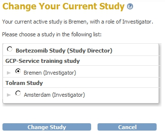

In the left column you see under Alerts & Messages "Your current active study has been changed succesfully".
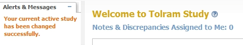

Another option is when you have rights to a Study as a whole, so to all the sites, for example the Bortezomib Study.

# Your “Home” in LibreClinica

After you've logged in successfully your "Home"-screen opens. This screen has links to your main activities in LibreClinica. In your case these are "Notes and Discrepancies Assigned to Me" and the so-called "Subject Matrix". We will come back to these in [Discrepancies: filtering by status, type, Event, Subject](#discrepancies-filtering-by-status-type-event-subject) and in [Choosing a subject; a shortcut; the Subject Matrix; filtering and sorting](#choosing-a-subject-a-shortcut-the-subject-matrix-filtering-and-sorting).

# Adding Study Subjects
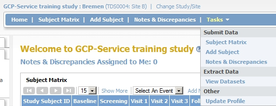

When you start entering data, the first thing you must do is add study subjects. This can be done in three ways:

1. By using the link Add New Subject, in the upper right corner of the Subject matrix
2. By using the menu-option Add Subject
3. By clicking the menu "Tasks"-"Submit Data"-"Add Subject"

When you choose one of the above the screen Add Subject opens. Here you provide the Study Subject ID, the Secondary ID, Date of Enrollment and Gender. Type in the following:
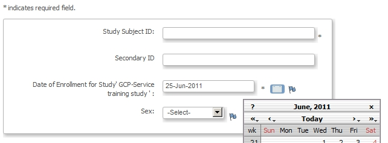

In Study Subject ID you provide the ID that is used to identify the study participant.

In Secondary ID you can type anything you want. This secondary ID can be used to find a Study Subject quicker. It is absolutely not allowed to use this field for data that can be used to identify someone, so no name, no social security number, no hospital ID, etc.

For Date of Enrollment you type in the date as two digits for the day, the first three letters of the month and four digits for the year, separated with dashes. You can also use the date picker, by clicking the calendar-icon. This opens a calendar-utility. Choose a date by scrolling to it and double-clicking it, or by selecting it and clicking "Select date".

After reviewing the data you click one of the three Save-buttons. Make sure the data are correct before Study or saving them, because you can not change them afterward. If you've made a mistake, you must contact the Study-coordinator who can change it.

If you've added a Subject by clicking the link Add New Subject in the Subject Matrix, you also get the input fields described above and furthermore the option to add a Study Event. You do not have to do it at this stage. Adding Events will discussed in [Adding or scheduling Events](#adding-or-scheduling-events).

# Choosing a subject; a shortcut; the Subject Matrix; filtering and sorting

If you have many Subjects in your Study or Site, there are three ways to find them quickly.

First of all you can use the input field in the upper right corner with "Study Subject ID" in it and a button labeled "Go" to the right of it. If you know the Study Id of a subject, type it here and click Go. The Subject Matrix appears with the Events of this Subject. For example you want to enter data for Subject TF031. You type "31" in the input field and click "Go".
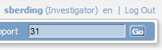

In the Subject Matrix that appears you see that under the header of the first column, labeled "Study Subject ID" your "31" is displayed and that all Events for "TF031" are in the matrix.

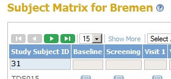

This brings us to the second way the quickly find Subject: by using filters in the Subject Matrix. You've already seen one example: filtering on Study Subject ID. You do this by typing in the input field directly under "Study Subject ID" a part of the ID your looking for and then clicking Apply Filter. When you click Show More, in the header of the Subject Matrix, more fields will be shown, that can be used for filtering as well, like the Secondary ID.

A third way to quickly find Subjects is by using another way of sorting the Subjects than the default way. By default the Subjects are shown in order of enrollment. If you want them sorted on Study Subject ID, just click on the blue header with "Study Subject ID". The subjects are shown in groups of 15 and you can scroll through them by using the buttons in the upper left corner. You can also set the number of Subjects on the page: 15, 25 of 50.

Another way of displaying the data of the Subject Matrix exists and that is by using "Select An Event". Now the Subject Matrix changes in a matrix with all Subjects plus all the CRFs used in this particular Event. Now you can see not only the status of the Event, but all statuses of all CRFs in that Event.

# Adding or scheduling Events
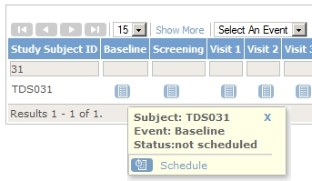

Adding a Study Visit for a Study Subject is called Scheduling an Event in LibreClinica. Before you can start DataEntry you must schedule the Event. This can be done:

1. 1.using menu option Tasks-Submit Data, Schedule Event
2. 2.from the Subject Matrix
3. 3.right after adding a Subject

In all three cases the screen Schedule Study Event appears, but if you use option 1, via the menu, you must provide the Study Subject ID.

Option 2, using the Subject Matrix, is easiest. Click in the Subject Matrix on the crossing of the row with the Subject and the column with the Event. If you, for example, want to enter data for the Screening Visit of Subject TDS031, you click the icon in the Matrix as shown in the picture. A small floating window appears and you can click on "Schedule". Now you can provide the details of the Event, like Location, Start and Stop date, etc.

When you use option 3, i.e. right after adding a new Subject you click Save and Assign Study Event, in stead of Save and Finish, the same screen appears.

Also in this form all required fields are marked with an asterisk. Finish the scheduling by clicking Proceed to Enter Data.

The form Enter or Validate Data for CRFs in Baseline appears. This may be a bit confusing, because an Event can contain one or more CRFs.  For this reason this form is displayed so you can specify for which CRFs you want to enter data.
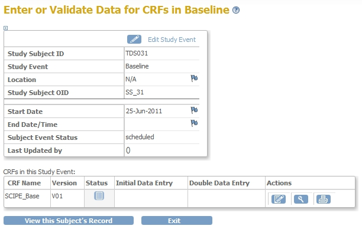

Each CRF has one or more versions. One version is set as default, but you can choose from all the available versions. Take the default version, unless you are instructed otherwise by the Study Coordinator. You start DataEntry by clicking the pencil-icon, to the right of the CRF.

If you only want to view the CRF, you can use the magnifier-icon.

If you want to print the data on the CRF, click on the printer-icon.

# Data-entry: elements in the screen

The screen "Base V09" is now displayed. In the upper part of the screen you see the name of the CRF, "Base", the version, "V09", and the Subject ID, "TDS023". By default, more information about the Event and about the Discrepancies on this CRF is hidden. This information can be displayed by clicking CRF Header Info.
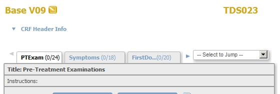

The lower part of the screen is used for the input fields. These are divided among one or more tabs. You select tabs by clicking on them, or by using the select-box to the right of the tabs (– Select to Jump --). Behind the name of each tab are two numbers, indicating the number of items answered and the total number of items on a tab.
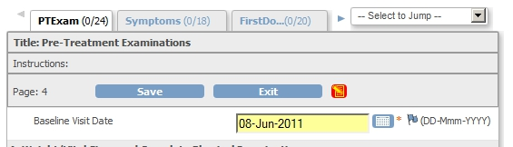

When you start entering data, the form will change. To the right of the buttons Exit red and yellow icons appear, to indicate that the form contains data that have to be saved. Input fields with changed data get a yellow background.
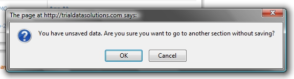

When you click one of the Save-buttons the data will be saved. If the CRF you're working on has more than one tab, the next tab will be displayed.

If you click Exit or move to another tab and the data have not been saved yet, a pop-up appears with a warning message. Click "Cancel" to return to the CRF and save the data or click "OK" if the changes do not have to be saved.

When the data have been stored successfully, the message appears "Your data has been saved. You may continue entering/editing data now or return at a later time."

In the next section other aspects of Data-entry will be discussed.

# Changing the attributes of an Event

Every now and then you may want to change attributes of an Event, for example the Start-date. You do this by clicking in the Subject Matrix on the Event you want to change. In the floating window that appears, click on "View/Enter Data". The screen "Enter or Validate Data for CRFs in [CRF-name]" appears. Click on the pencil-icon or on the link "Edit Study Event" in the upper right corner.

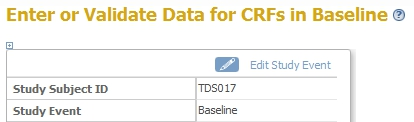

You can now change Location and Start and Stop date. You also have the option to change the status of an Event. This will be discussed in more detail in section [The status of a CRF and of an Event](#the-status-of-a-crf-and-of-an-event).

# Data-entry: required fields and error-messages

In a CRF all required fields are indicated with a red asterisk.

If you try to save a CRF by clicking the Save -button and not all required fields are filled in,  the message "There are issue(s) with your submission. The data has NOT been saved. See below for details." appears, plus the message "Missing data in a required field." If the data is available, you can enter it and save the data by clicking Save.
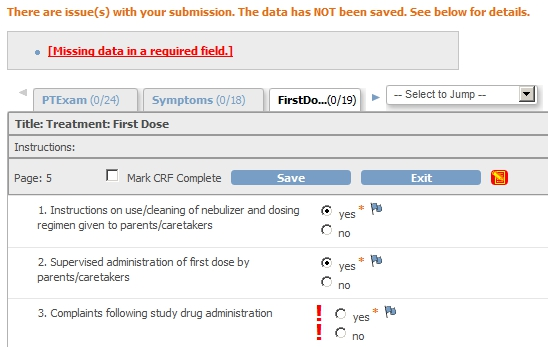

If the data is and will not be available you will have to make a Note/Discrepancy. You do this by clicking by clicking the flag-icon, to the right of the input field. A new window will appear, "Add Discrepancy Note". The Subject is displayed, the Item concerned and the type of Discrepancy. In this case it is a "Failed Validation Check". In "Description" you provide a reason, for example "forgot to ask." Now click on Submit. Close the window and click on Save in the CRF screen. Now the data will be saved and the following message appears: "Your data has been saved. You may continue entering/editing data now or return at a later time."

The Study Coordinator or the Monitor can reply to your Discrepancy Note. In that case the status will change from "New" to "Updated". More about this will be discussed in section [Discrepancies: filtering by status, type, Event, Subject](#discrepancies-filtering-by-status-type-event-subject).

You follow the same procedure if you get the message that your input is out of range. For example a Subject weighs 155 kilo, and on entering this, the message "Please provide a weight between 45 and 150 kg." appears.

# Adding a Note

When you're entering data you may want to consult the Study Coordinator or the Monitor. For example the Subject answered to the question "Do you smoke?" not by ticking Yes or NO, but wrote on the CRF "I quit last week." You add a Note by clicking on the blue flag-icon and the same screen "Add Discrepancy Note" appears. The only difference is that "Resolution status" cannot be changed.

# Discrepancies: filtering by status, type, Event, Subject

You can get a list of all Discrepancies by clicking Notes & Discrepancies in the top of your screen.

Until now we saw two types of Discrepancies: "Failed Validation Check" and "Annotation". Two more exist: "Query" and "Reason for Change"

The first type, "Failed Validation Check", is raised if a value is entered that exceeds a certain range, or if a Validation check if violated, for example a weight of more than 150 kg.

The second type, "Annotation" occurs when you want to add a note to an input field.

The third type, "Query", is a lot like "Annotation", but is made by a Monitor or Investigator. If he/she wants to ask you a question about data entered, he/she does this by creating a Note of type Query. You can see which Discrepancies are assigned to you by clicking Home, followed by clicking Notes & Discrepancies Assigned to Me.

The fourth type, "Reason for Change" is raised when data are changed on a CRF that was already marked as "Complete" (see section [Changing data in complete CRFs](#changing-data-in-complete-crfs)).

If you open Notes and Discrepancy the discrepancies will be shown in a form similar to the Subject Matrix.
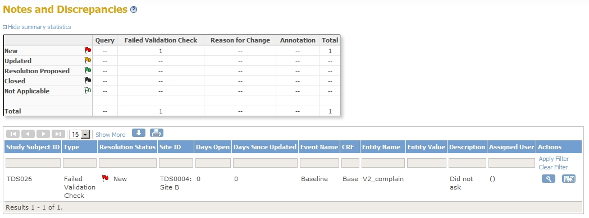

Many extra attributes can be shown, such as CRF, Item, Value, Error-message and the user whom this Query is assigned to.

By clicking on the Down-arrow-icon you can download the discrepancies as a PDF or as a comma-separated list of values.

# An example of a discrepancy

Let's work out a Discrepancy. You're filling in a CRF and for weight you're entering a number that's out of range. Our example is from a Study with children and the maximum weight is 60 kg. When the Save-button is clicked, a message will appear "There are issue(s) with your submission. The data has NOT been saved. See below for details" plus in red the message "Value for weight out of range! (8-60)".
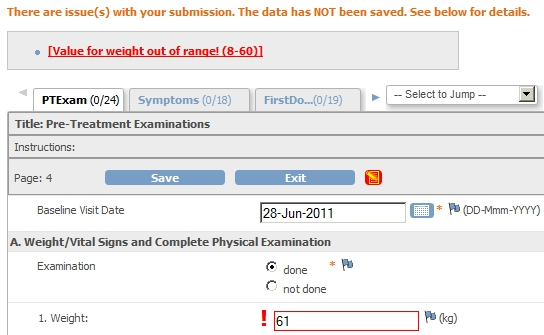

Click on the blue flag, next to the input field and a new window opens "Add Discrepancy Note."

In this window you give a short description of your problem in the input filed "Description". In "Detailed Note" you can give more information. Let's assume that you find the value acceptable. You write this in the Detailed Note and change "Set to Status" to "Resolution proposed".

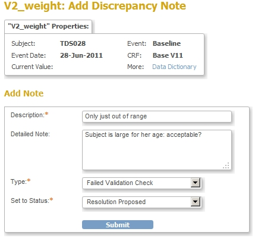

Click on button Submit and close the window. You are now back in the window with the CRF. The color of the flag has changed from blue to green, indicating the status of the Discrepancy (Resolution Proposed). Click on Save. The data will now be saved and the next tab of the CRF opens, and you can continue data-entry.

Now let's take a closer look at the Discrepancy. A discrepancy is a collection of comments on an item of a CRF. The comments are called Notes and the collection of Notes is called a Thread.

If you want to see the status of all the Discrepancies of your Subjects, click on menu-option Notes & Discrepancies.
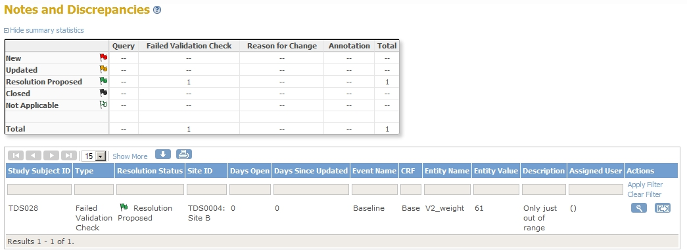

If the Monitor logs in, he/she will check for any new or changed Discrepancies. The Discrepancy you just created will be in the list and by clicking on the arrow-icon it will be opened. If the value is indeed acceptable to the Monitor, he/she can close the Discrepancy by clicking Close Note and adding a comment.
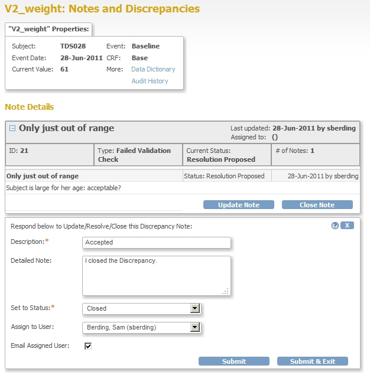

Now when you log in and click on Notes & Discrepancies, you will see the new status of the Discrepancy, closed. The colour of the flag is now black.

# Mark CRF Complete

When data-entry is complete and all Discrepancies have been solved, then the CRF can be marked as Complete. You do this by going to the last tab of the CRF. Next to the buttons "Save" en "Exit" is a check-box "Mark CRF Complete".
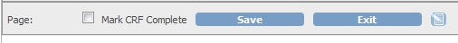

On ticking this check-box, a pop-up window appears with a warning message:
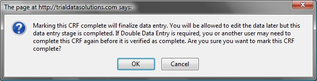

After clicking the OK-button, you must save the CRF. If you do not save the CRF, it will not be marked as Complete.

# The status of a CRF and of an Event

An Event can have different statuses. These are indicated by icons and these icons are used for Events and for CRFs, which can be confusing. We'll first discuss the status of a CRF.

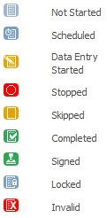

When nothing has happened yet the status of a CRF will be "Not Started". Once you've opened the CRF for data-entry the status changes to "Data Entry Started", even if you haven't entered any data. After you have entered the data and marked the CRF as complete by ticking the check-box "Mark CRF Complete" the status of the CRF will change to "Completed".

The status of an Event changes in a similar way, but it has more statuses. You can see these in the Subject Matrix.

If no date has been given for an Event, the status is "Not Started".

If a start-date is given, but no data-entry has been performed the status is "Scheduled".

If data-entry has started on one of the CRFs of the Event, the status will change to "Data Entry Started".

When all required CRFs of an Event are "Marked as Complete, the status of the Event will change to "Completed".

Sometimes a visit is skipped. In that case you can manually set the status on  "Skipped".

In very rare circumstances data-entry of a CRF can be stopped halfway. In that case you can manually set the status to "Stopped".

To manually set the status of an Event you first schedule it, if you haven't already done so. In the Subject Matrix you click the visit and in the floating window you click "View/Enter Data". In the screen Enter or Validate Data for CRFs in [Event name] you click "Edit Study Event" or the pencil-icon in the upper right corner. At the bottom of the screen you can set the status of the Event to "Skipped" or "Stopped".

CRFs can be checked, using the source documents, the so called Source Document Verification or SDV. This is done by the Monitor and it will not be visible to you by a change in icons.

Finally you as the Investigator can electronically sign all CRFs of a Subject. We will discuss this in the next paragraph.

# Signing CRFs

Once you've finished entering the data for a Subject, you can "sign" the CRFs. This is done in the Subject Matrix. In the right column a green icon of a pen appears and in the legend it says "Signed", but in this case it means "Click to sign the CRFs of this Subject".

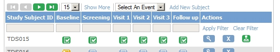

When you click on the green icon with the pen, a new screen opens with the statement "As the investigator or designated member of the investigator's staff, I confirm that the electronic case report forms for this subject are a full, accurate, and complete record of the observations recorded. I intend for this electronic signature to be the legally binding equivalent of my written signature."

For this electronic signature to be valid, you must supply your username plus your LibreClinica-password. This must be repeated for very subject that you sign.

After signing the subject, the icons of the all the Events change to the green "Signed"-icon; the icons of the CRFs will stay the same, "Completed".

# Changing data in complete CRFs

If you change data in a CRF of an Event with status "Complete", you must provide a reason for this change. This indicated by the message in red.

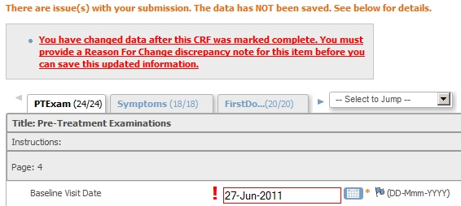

To provide this reason for change, click on the flag of the item you changed. A new window opens in which you can write your reason. Click Submit & Close and now you are able to save the data on the CRF. The colour of the flag will change from blue to white.

After changing data of a CRF belonging to a Subject already "signed", the signing must be done again. In the Subject Matrix, the status of the Event will change from "Signed" to "Completed".
